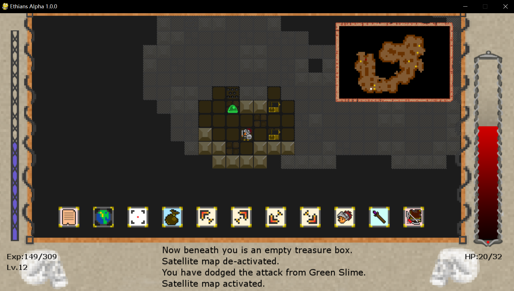
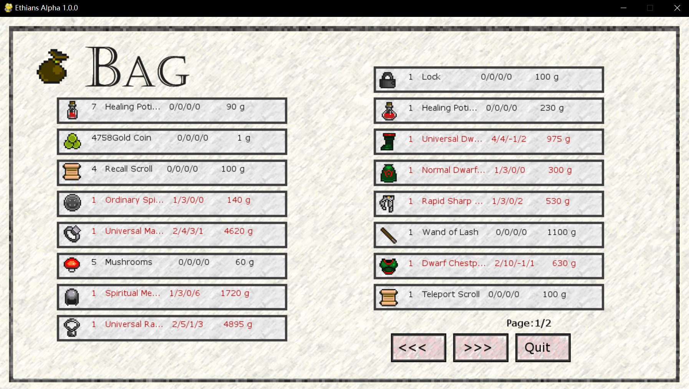
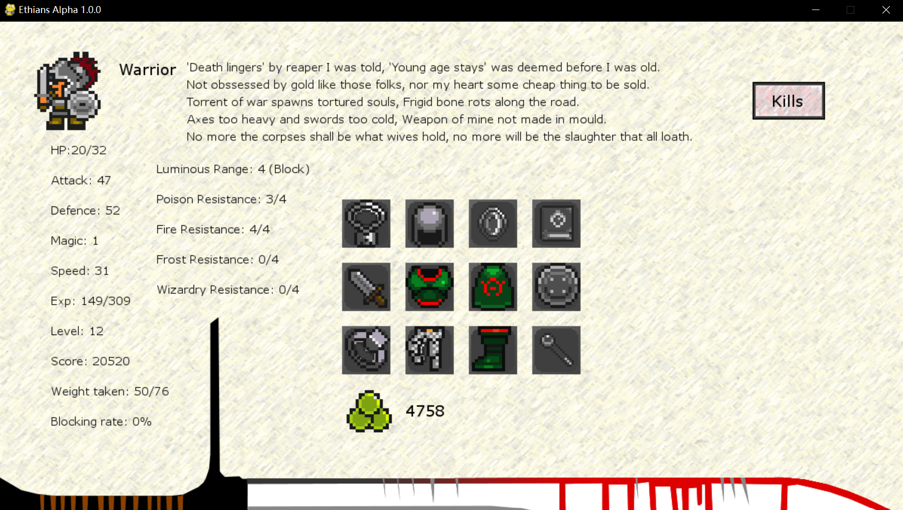
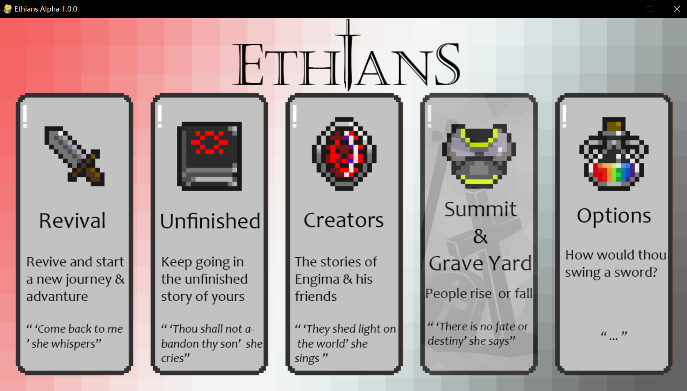
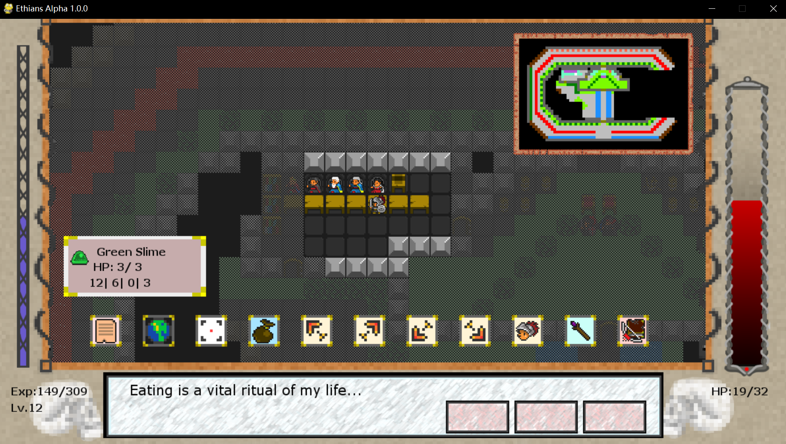

# Ethians-Alpha-1.1

---

## I. Intros

My own Rougelike game during the first year of university. This project is currently suspended until 2021.11.27, the latest  minor revisions and organization are added.

A Rougelike game, in the hope of implement some of my own ideas. About the origin version of this project, search `Dweller`.

Some of the images in the `asset` folder are sourced from the game *Dweller*, including all the monsters and some items. The rest were created by me using Photoshop.

I started working on this project intermittently in January 2019 and finished it on August 29, 2019. After completing the data structures and algorithms course, I made some optimizations to the project, but they were very limited. The code structure of this project is too messy, with unclear relationships between classes, making it hard to maintain. That's why I call it a **practice project.**
As for this game, I might consider refactoring (or even rewriting) it when I have time in the future. There are too many implementations in it that, from my current perspective, are garbage.
Personally, I no longer want to use Pygame for this project. Pygame lacks a good interaction system, so I had to implement interactions myself, which is a bit uncomfortable. If I do decide to refactor it, I plan to use C# to streamline the development of the GUI, animations, interactions, and parallel programming.

##### Loading the game and resume from the saved check-point

https://github.com/user-attachments/assets/16167dc8-70ec-4a80-8575-989047c009a3

##### Explore... and die (will be recorded in the Valhalla)


https://github.com/user-attachments/assets/a02e9d06-b4ae-4b0c-a8b1-dc8e1c3de479


---

## II. Gameplay

### 2.1 Randomly Generated Maps

- The dungeon is randomly generated and includes a map editor for custom map creation.
- Traps, treasure chests, monsters, and terrain are rich and varied.
- FOV shadow casting for fog of war algorithm, with a mini-map display.



### 2.2 Equipment & Inventory System

- Equipment levels and affix bonuses.
- Enchantment upgrades with random names and attributes.
- Equipment drop system.
- Character attributes, resistances, and game information tracking.
- Three classes: Berserker, Ranger, Wizard.
- Character level system, shop trading system, and NPC dialogue.





### 2.3 Simple AI

- The AI that controls mobs has a intelligence level.
- All the hostile mobs will chase you if you are perceived by them (an efficient A*).
- Some of the smart mobs will flee if they are low on HP.
- Some might cast spells on you or teleport themselves when hit.
- Some might break through the door like FBI agents, even if you shut the door.

### 2.4 Main Menu & Easter Eggs

- An Easter egg world created by the game developers, featuring the developer's family.
- Valhalla: Records death information and completion details.
- Supports game saving.
- Supports keyboard customization.





---

## III. Play

​		Only depends on Pygame (Pygame 1.9.6 and 2.5.2 are tested), for both Windows and Ubuntu

```
python ./main.py
```

